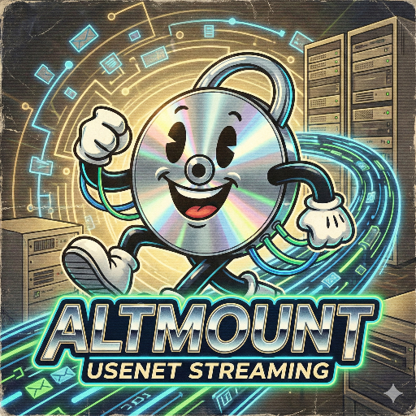

# AltMount

<p align="center">
  
</p>

A WebDAV server backed by NZB/Usenet that provides seamless access to Usenet content through standard WebDAV protocols.

[](https://www.buymeacoffee.com/qbt52hh7sjd)

## 📖 Documentation

**[View Full Documentation →](https://javi11.github.io/altmount/)**

Complete setup guides, configuration options, API reference, and troubleshooting information.

## Features

- **Virtual Filesystem:** Mount your Usenet provider as a local directory.
- **On-the-Fly Streaming:** Stream media files (e.g., MKV, MP4) directly from Usenet.
- **RAR & 7z Support:** Automatically handles RAR and uncompressed 7z archives, presenting their contents as regular files.
- **Rclone Encryption:** Supports reading from rclone-encrypted remotes.
- **Metadata Caching:** Caches file and directory metadata for fast browsing.
- **Health Checks:** Monitors provider health and tracks corrupted files.

### 7z Archive Support

- Only uncompressed (Copy) 7z archives are supported for streaming.
- Use `Stream7zMKV(filePath)` for streaming MKVs directly from a 7z archive.
- Use `Stream7zFile(filePath, ".ext")` for streaming other file types.

## Quick Start

### Docker (Recommended)

```bash
services:
  altmount:
    extra_hosts:
      - "host.docker.internal:host-gateway"
    image: ghcr.io/javi11/altmount:latest
    container_name: altmount
    environment:
      - PUID=1000
      - PGID=1000
      - PORT=8080
      - COOKIE_DOMAIN=localhost # Must match the domain/IP where web interface is accessed
    volumes:
      - ./config:/config
      - ./metadata:/metadata
      - ./mnt:/mnt
    ports:
      - "8080:8080"
    restart: unless-stopped
```

### CLI Installation

```bash
go install github.com/javi11/altmount@latest
altmount serve --config config.yaml
```

## Links

- 📚 [Documentation](https://altmount.kipsilabs.top)
- 🐛 [Issues](https://github.com/javi11/altmount/issues)
- 💬 [Discussions](https://github.com/javi11/altmount/discussions)

## Contributing

See the [Development Guide](https://altmount.kipsilabs.top/docs/Development/setup). Development/setup for information on setting up a development environment and contributing to the project.

## License

This project is licensed under the terms specified in the [LICENSE](LICENSE) file.
